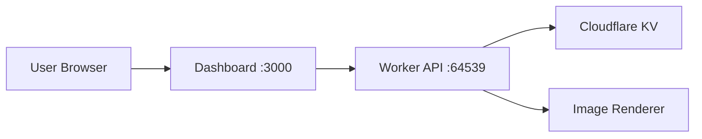

# 🚀 Edge-OG Full Stack Setup

## 📖 **Architecture Overview**

The Edge-OG project consists of two separate services that work together:

### 🔧 **Backend Worker API** (localhost:64539)
- **Purpose**: Cloudflare Worker serving API endpoints and OG image generation
- **Technology**: TypeScript + Cloudflare Workers + KV Storage
- **Endpoints**:
  - `GET /` → Redirects to Dashboard (302)
  - `GET /health` → Health check
  - `GET /og` → Generate OG images (with API key support)
  - `POST /dashboard/api-keys` → Create API keys
  - `GET /dashboard/api-keys?userId=X` → List API keys
  - `GET /dashboard/user/:userId` → Get user quota info
  - `DELETE /dashboard/api-keys/:keyId` → Revoke API keys

### 🎨 **Frontend Dashboard** (localhost:3000)
- **Purpose**: Next.js web interface for API key management and image testing
- **Technology**: Next.js 15 + React 19 + Tailwind CSS
- **Features**:
  - API Key Management UI
  - Quota Usage Monitoring
  - OG Image Testing Interface
  - Real-time Preview

## 🏃‍♂️ **Development Setup**

### 1. Start the Worker API
```bash
cd packages/worker
npx wrangler dev --local
# Runs on http://localhost:64539
```

### 2. Start the Dashboard
```bash
cd apps/dashboard  
npm run dev
# Runs on http://localhost:3000
```

### 3. Access the Application
- **Main Dashboard**: http://localhost:3000
- **API Base URL**: http://localhost:64539
- **Health Check**: http://localhost:64539/health

## 🔗 **Service Communication**



1. **User** accesses dashboard at `localhost:3000`
2. **Dashboard** makes API calls to `localhost:64539`
3. **Worker** processes requests and stores data in KV
4. **Worker** generates images and returns responses

## 📋 **Testing Workflow**

### Quick Test Commands
```bash
# Test worker redirect
curl -v http://localhost:64539/

# Test API endpoint
curl http://localhost:64539/health

# Create API key
curl -X POST http://localhost:64539/dashboard/api-keys \
  -H "Content-Type: application/json" \
  -d '{"userId":"test-user","name":"Test Key","quotaLimit":1000}'

# Generate OG image
curl "http://localhost:64539/og?title=Test&description=Hello" \
  --output test-image.svg
```

### Full Integration Test
```bash
./test-integration.sh
```

## 🔑 **API Key Management Flow**

1. **Create Key**: Dashboard → `POST /dashboard/api-keys`
2. **List Keys**: Dashboard → `GET /dashboard/api-keys?userId=X`
3. **Monitor Usage**: Dashboard → `GET /dashboard/user/:userId`
4. **Generate Images**: Client → `GET /og?api_key=X&title=...`
5. **Revoke Key**: Dashboard → `DELETE /dashboard/api-keys/:keyId`

## 🎯 **Key Features Implemented**

### ✅ Backend (AQ-1)
- [x] Secure API key generation (`edgeog_` prefix)
- [x] SHA-256 hashing with salts
- [x] Quota management and tracking
- [x] KV storage integration
- [x] Dashboard API endpoints
- [x] OG image generation with authentication
- [x] Error handling and logging

### ✅ Frontend Integration
- [x] API Key Management UI
- [x] Real-time quota monitoring
- [x] OG Image Testing interface
- [x] Key creation/revocation
- [x] Visual quota progress bars
- [x] Copy/download functionality

## 🔍 **Environment Variables**

### Worker (.env or wrangler.toml)
```toml
[env.development.vars]
# Add any worker-specific variables
```

### Dashboard (.env.local)
```env
NEXT_PUBLIC_API_URL=http://localhost:64539
NEXT_PUBLIC_DEBUG=true
```

## 🚀 **Production Deployment**

### Worker
```bash
cd packages/worker
npx wrangler deploy
```

### Dashboard
```bash
cd apps/dashboard
npm run build
# Deploy static files to Cloudflare Pages, Vercel, etc.
```

## 📝 **Notes**

- **PNG Generation**: Works in production, falls back to SVG in local development due to WASM limitations
- **CORS**: Handled automatically by worker for dashboard requests  
- **Security**: API keys are hashed, never stored in plain text
- **Caching**: Images cached for 1 year with proper ETags
- **Monitoring**: Comprehensive structured logging for all operations

The architecture cleanly separates concerns while providing a seamless user experience! 🎉
